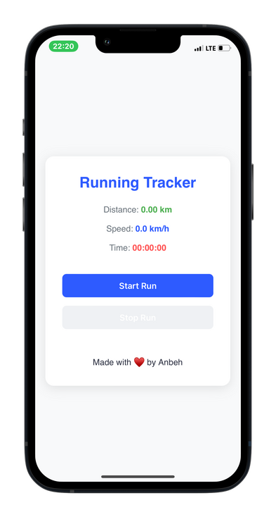

# Velocita - Running Tracker App

Velocita is a simple and intuitive running tracker app designed to help you gather detailed information about your running exercises. Whether you're a beginner or a seasoned runner, Velocita provides the tools you need to track your progress, analyze your performance, and achieve your fitness goals.

  
## Features

- **Simple UI**: Clean and user-friendly interface for easy navigation.
- **Run Tracking**: Accurately track your distance, pace, duration, and calories burned.
- **Route Mapping**: Visualize your running routes with integrated maps.
- **Progress Insights**: View detailed statistics and trends over time.
- **Custom Goals**: Set and monitor personalized running goals.
- **Export Data**: Export your running data for further analysis or sharing.

## How to Use

1. **Start a Run**: Open the app and tap "Start Run" to begin tracking your exercise.
2. **Monitor Progress**: View real-time stats like distance, pace, and time on the screen.
3. **Save & Analyze**: Save your run to review detailed insights and track your progress over time.
4. **Set Goals**: Use the app to set weekly or monthly running goals and stay motivated.

## Installation

To install Velocita, follow these steps:

1. Download the app from the Releases section or just add it's PWA.
2. Install the app on your device.
3. Open the app, and start tracking your runs!

## Support

If you encounter any issues or have suggestions for improvement, please reach out to us at [support@velocitaapp.com](mailto:support@velocitaapp.com).

## Contributing

We welcome contributions! If you'd like to contribute to Velocita, please fork the repository and submit a pull request. For major changes, open an issue first to discuss your ideas.

## License

Velocita is licensed under the MIT License. See [LICENSE](LICENSE) for more details.

---

**Run smarter, not harder. Download Velocita today and take your running to the next level!**
